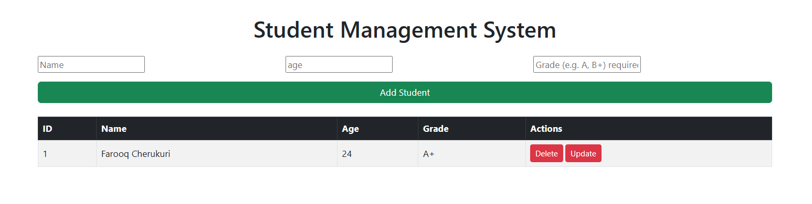
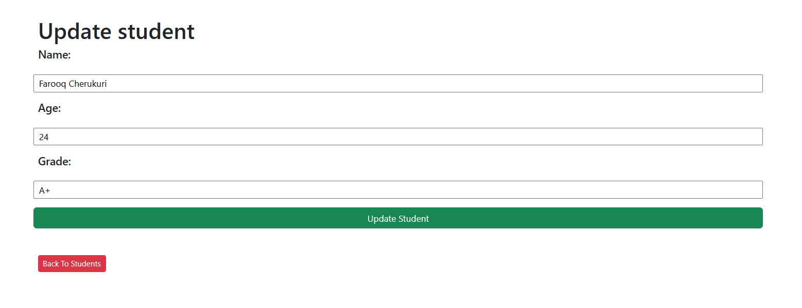

# Student Management System

A full-stack Student Management System built using HTML, CSS, Bootstrap, Python, Flask, and MySQL.

## Live Demo

https://student-management-system-gold-omega.vercel.app/

## Features

- Add new student records
- View all student records
- Update student information
- Delete student records
- Auto-incrementing student IDs
- MySQL database integration
- Responsive user interface using Bootstrap
- Flask-based backend
- Deployed online using Vercel
- Cloud MySQL database using Aiven

## Technology Stack

### Frontend
- HTML5
- CSS3
- Bootstrap 5

### Backend
- Python 3
- Flask

### Database
- MySQL

### Deployment
- Vercel
- Aiven MySQL


## Project Structure

```text
studentManagement/
|
├── templates/
│   ├── index.html
│   └── update.html
│
├── static/
│   └── style.css
│
├── app.py
├── requirements.txt
├── .gitignore
└── README.md
```

## Database Structure

### Database: `studentDB`

### Table: `students`

| Column | Data Type | Description |
|--------|-----------|-------------|
| `id` | INT | Primary key with auto-increment |
| `name` | VARCHAR(100) | Student name |
| `age` | INT | Student age |
| `grade` | VARCHAR(10) | Student grade |

The `id` column is automatically generated using MySQL `AUTO_INCREMENT`.


## How It Works

1. The user opens the Student Management System.
2. Flask handles requests from the frontend.
3. Student information is submitted through HTML forms.
4. Flask processes the request and executes SQL queries.
5. MySQL stores the student records.
6. The updated data is retrieved from MySQL and displayed on the frontend.
7. The application is deployed on Vercel and uses Aiven as the cloud MySQL database.

### CRUD Operations

| Operation | Description |
|-----------|-------------|
| Create | Add a new student |
| Read | View all students |
| Update | Modify existing student information |
| Delete | Remove a student record |

## Installation and Setup

### 1. Clone the Repository

```bash
git clone https://github.com/Farooq44/student-management-system.git
cd student-management-system
```

### 2. Create a Virtual Environment

```bash
python -m venv venv

Activate it on windows:
```bash
venc\Scripts\activate
```
### 3. Install Dependencies
```bash
pip install -r requirements.txt
```
### 4. Configure Environmental Variables
    Create a .env file in the project root:
    </> env

    DB_HOST=localhost
    DB_USER=root
    DB_PASSWORD=your_mysql_password
    DB_NAME=studentDB
    DB_PORT=3306

### 5. Create the Database

create MySQL database named:
    CREATE DATABASE studentDB;

Then create the "students" table:

    CREATE TABLE students (
    id INT AUTO_INCREMENT PRIMARY KEY,
    name VARCHAR(100) NOT NULL,
    age INT NOT NULL,
    grade VARCHAR(10) NOT NULL
    );

### 6. Run Application
    ```bash
        python app.py

    open your Browser and Visit:
        http://127.0.0.1:5000
    

[Certain] **Important:** Keep `.env` out of GitHub. Your existing `.gitignore` should contain:

```text
.env
venv/
__pycache__/
*.pyc
```

## Deployment

The application is deployed using Vercel.

### Frontend & Backend
- Vercel

### Cloud Database
- Aiven MySQL

### Live Application

https://student-management-system-gold-omega.vercel.app/

## What I Learned

Through this project, I learned and practiced:

- Building web pages with HTML5 and CSS3
- Creating responsive interfaces with Bootstrap
- Using JavaScript for frontend interactions
- Building web applications with Python and Flask
- Creating Flask routes and handling HTTP requests
- Connecting Flask applications to MySQL
- Performing CRUD operations using SQL
- Using environment variables to protect database credentials
- Using Git and GitHub for version control
- Deploying a Flask application with Vercel
- Connecting a web application to a cloud MySQL database
- Debugging deployment and database connection issues


## Future Improvements

The following features can be added in future versions:

- Student search and filtering
- Pagination for large student datasets
- User authentication and authorization
- Admin dashboard
- Form validation and improved error handling
- Student profile pages
- Export student records to CSV or Excel
- REST API integration
- Improved UI/UX
- Automated testing


screenshots/
├── home.png
└── update.png

## Screenshots

### Home Page



### Update Student



## Author

**Farooq Cherukuri**

- GitHub: https://github.com/Farooq44
- Email Address: chfarooq2001@gmail.com
